<div align="center">



<a href="https://linkedin.com/in/buitrunghieu735"></a>
<a href="mailto:hieu.bt2409@gmail.com"></a>
<a href="https://github.com/hieubui2409"></a>
<a href="https://www.facebook.com/lucas.bui.personal"></a>
<a href="https://t.me/lucasbui2409"></a>
<a href="https://www.instagram.com/_lucas.bui_"></a>

</div>

```text
┌─[ hieubui2409@vsf ]─[ ~/identity ]
│
│  $ whoami --verbose
│  ▸ Bui Trung Hieu (Lucas Bui) — Senior AI Engineer & R&D Solution Architect
│  ▸ 7+ years: fault-tolerant backends (Java/Go/Python) → AI platform architecture
│  ▸ Shipped: Enterprise AI Agent Mesh · vision-LLM IDP/OCR · two-tier AI-driven SDLC
│  ▸ Standards work: Agent-to-Agent (A2A) protocols · Model Context Protocol (MCP)
│  ▸ Base: Hai Ba Trung, Hanoi, Vietnam
│
│  $ mission --current
│  ▸ Architecting fault-tolerant, scalable multi-agent ecosystems from the ground up —
│    pushing the boundaries of what LLMs can do inside the enterprise.
│
└─[ status: ONLINE ]──────────────────────────────────────────── [ ● ● ● ]
```


## `⌬` CORE SYSTEMS — TECHNICAL EXPERTISE

<table>
<tr><td width="180"><b><code>LANGUAGES</code></b></td><td>

     
</td></tr>
<tr><td><b><code>AI / AGENTIC</code></b></td><td>

    `A2A` `AG-UI` `Vision-LLM IDP/OCR` `LLM & Prompt Engineering` `LLM Guardrails`
</td></tr>
<tr><td><b><code>AI TOOLING</code></b></td><td>

   `Claude Agent SDK` `Skills / Agents / Hooks` `uv` `Jinja`
</td></tr>
<tr><td><b><code>BACKEND</code></b></td><td>

   
</td></tr>
<tr><td><b><code>FRONTEND / MOBILE</code></b></td><td>

     `TornadoFX`
</td></tr>
<tr><td><b><code>DATA / STREAMING</code></b></td><td>

     `TiDB` `Dremio` `SSE`
</td></tr>
<tr><td><b><code>CLOUD / DEVOPS</code></b></td><td>

  -326CE5?style=flat-square&logo=kubernetes&logoColor=white)  `OAuth / MSAL`
</td></tr>
<tr><td><b><code>OBSERVABILITY</code></b></td><td>

   `Langfuse` `Loguru`
</td></tr>
<tr><td><b><code>ARCHITECTURE</code></b></td><td>

`AI Agent Mesh` `Multi-Agent Systems` `Event-Driven (EDA)` `Microservices` `Rule Engines` `Hybrid Service Registry` `Multitenancy` `Circuit Breakers`
</td></tr>
</table>


## `⌬` MISSION LOG — PROFESSIONAL EXPERIENCE

### `[ ACTIVE ]` 🤖 Vinsmart Future (VSF) — Vingroup · *Senior AI Engineer*
`Jun 2026 – Present` · TechnoPark Tower, Hanoi, Vietnam

> The Vingroup company delivering **unified technology & AI solutions** across the entire corporation. Researching and developing the **group-wide shared AI platform** — defining foundational AI standards, agent-mesh infrastructure, MCP tooling, and reusable AI capabilities adopted across the group's businesses.
>
> **Tech:** `Python` `Google ADK` `MCP` `Gemini / Vertex AI` `FastAPI` `Claude Code` `Claude Agent SDK`

<details>
  <summary><strong>🧾 AIOP — Enterprise IDP + OCR Platform</strong> <em>(AI in Enterprise Finance)</em></summary>
  <br>

  - Architected the **document-intake core (IDP/OCR)** of a **13-module Finance Automation Platform** serving **4 business units** — **vision-LLM (Gemini)** extraction of Vietnamese financial documents (VAT invoices, goods receipts, POs, payment requests) with **per-field confidence scoring** and **page-anchor evidence** meeting the 10-year legal audit-retention requirement.
  - Designed a **config-driven OCR template system** (JSON Schema 2020-12): per-field thresholds, business validators (tax-ID checksum, VAT arithmetic), PII masking, and auto-accept / **HITL** routing — new document types onboard with **zero code changes**, including base→derived template inheritance.
  - Engineered a **composite confidence engine** (validator → grounding → double-pass → reference-match) plus a **golden-set replay deploy gate** that blocks model/prompt regressions before release — prototype at **~95% field-level accuracy**, **2.8s p95** latency, designed for **1,000+ docs/day**.
  - **Tech Stack:** `Python` `Gemini vision-LLM` `FastMCP` `PostgreSQL` `Redis` `Camunda` `OpenTelemetry`
</details>

<details>
  <summary><strong>⚙️ SDLC Harness + Autonomous Agent Orchestrator</strong> <em>(New AI-Driven SDLC)</em></summary>
  <br>

  - Built a **two-tier AI-driven SDLC platform** (~130k LOC Python, **~7,900 automated tests**): a governance **harness** forcing AI coding agents through a real pipeline — *plan → code → test → review* — plus an **autonomous orchestrator** running the loop unattended.
  - Harness: **100+ skills**, **24 specialized subagents**, **59 lifecycle hooks** in three postures (fail-open telemetry/nudge, **fail-closed compliance**), artifact-backed quality gates, **RBAC agent cage**, enforced **red→green TDD**, and a **hash-chained tamper-evident audit trail**.
  - Orchestrator: a deterministic Python driver treating the LLM as a callable function — **DRIVE / OBSERVE / GATE / INJECT** primitives on `claude-agent-sdk`, **zero-token quality detectors** (confabulation, silent-success, wiring), a **taxonomy-coverage grid engine**, and a self-correcting **critic loop**; **230+ recorded architecture decisions**.
  - **Tech Stack:** `Python` `Claude Agent SDK` `MCP` `pytest` `SQLite-WAL` `Dual-engine review lanes (Gemini + secondary Claude)`
</details>

### `[ ARCHIVE ]` 🏢 One Mount Group · *Senior Software Engineer*
`Sep 2020 – Jun 2026` · Hanoi, Vietnam

> Evolved from Senior Software Engineer into **Solution Architect & R&D Lead**, pioneering distributed platforms — Enterprise AI Agent Mesh and high-performance microservices.

<details>
  <summary><strong>🕸️ Agent Space — Enterprise AI-Agentic Platform (Agent Mesh)</strong> <em>(Jul 2025 – Jun 2026)</em></summary>
  <br>

  - Spearheaded a **9-month R&D initiative** to architect and deploy a proprietary Python-based **8-Layer Enterprise Agent Mesh Platform**, using a customized **Agent Development Kit (ADK)** to orchestrate **hundreds of AI agents** as collaborative virtual employees across **Root / Parent / Sub-agent** tiers.
  - Architected a **Hybrid Service Registry** (two-layer pattern: durable Firestore *Profile Layer* + ephemeral Redis *Pulse Layer* with TTL liveness), achieving **<100ms discovery latency** and **5 load-balancing strategies** (Random, Round-Robin, Least-Conn, Weighted, Consistent Hash).
  - Designed dynamic tool integration via **Model Context Protocol (MCP)** for seamless access to external APIs, knowledge bases, and code-lookup services; migrated dependency/venv management to **uv** to accelerate the R&D cycle.
  - Engineered a rigorous **4-Layer Loop Prevention** system (app-level hop limits, network circuit breakers, trace-hash deduplication, real-time anomaly detection).
  - Extended the ADK with **long-term memory management & compaction** (token budgeting + waterfall thresholds) to prevent LLM context exhaustion and dramatically cut API costs.
  - Integrated an **observability stack** — Langfuse v3 (LLM cost/token), OpenTelemetry (context propagation), Loguru (distributed JSON tracing).
  - Deployed a unified **multi-adapter Gateway** (Teams MSAL OAuth, Google Chat ADC, Web UI) with **AG-UI / A2UI** dynamic rendering over **SSE** — **>10K events/sec** throughput, **<16ms** UI render.
  - Shipped 2 production use cases: an **Internal Operations Virtual Assistant** and a **Delivery Assistant** integrated with the Transport Management System (TMS) for autonomous scheduling with **Human-in-the-Loop (HITL)**.
  - **Tech Stack:** `Python` `Google ADK` `MCP` `A2A` `AG-UI` `Firestore` `Redis` `SSE` `Langfuse` `OpenTelemetry`
</details>

<details>
  <summary><strong>🧪 AISDLC — AI Integration in Enterprise SDLC</strong> <em>(Jan 2025 – Jun 2026)</em></summary>
  <br>

  - Partnered directly with a **20-member executive board** (C-level + senior domain experts) to formulate, evaluate, and execute AI integration strategy for the enterprise **Software Development Life Cycle**.
  - Benchmarked cutting-edge LLMs (**Gemini 3 Pro/Flash**, **Vertex AI**) and self-hosted models (**Gemma, GLM, Qwen**) for performance, quality, and ROI.
  - Engineered specialized AI agents (**OM Git Agent, OM Jira Agent, AI Manual Tester**) with custom personas, cognitive methods, and skill sets.
  - Implemented robust **AI guardrails** using dynamic LLM-based command-safety evaluation (replacing static regex) to mitigate prompt injection; enforced a strict **read-only** execution protocol — zero unauthorized code modifications, outputs limited to actionable docs and review reports.
  - Built end-to-end automated workflows: agents autonomously perform code reviews, audit commit history, verify Jira compliance, and generate proactive security/compliance reports.
  - **Tech Stack:** `Gemini 3` `Vertex AI` `Self-hosted LLMs` `MCP` `AI Guardrails`
</details>

<details>
  <summary><strong>📊 Metric Platforms — Centralized Metric Engine</strong> <em>(Sep 2024 – Jun 2025)</em></summary>
  <br>

  - Led and mentored a cross-functional team of **12 engineers** to overhaul and modernize the core **Metric Platform** — a centralized hub for KPI and promotional-data calculations.
  - Engineered high-throughput dynamic ingestion pipelines across **REST APIs, Data Lakes (Dremio), Oracle, TiDB, and Kafka**.
  - Merged the metric core with a custom **Rule Engine** + drag-and-drop **Rule Builder UI**, empowering Ops to configure complex KPI formulas without engineering intervention.
  - Optimized **multitenancy** for strict data isolation and fault tolerance; added execution resilience with **Temporal** retries/state management and Splunk + Google Chat alerting.
  - **Tech Stack:** `Golang` `Temporal` `Kafka` `Dremio` `Oracle` `TiDB` `Splunk`
</details>

<details>
  <summary><strong>🗓️ HRM — Leave & Attendance Management System</strong> <em>(Sep 2023 – Sep 2024)</em></summary>
  <br>

  - Architected a highly available, real-time multi-service ecosystem (**Golang + Temporal**) automating attendance/timesheet calculation for a large distributed field-sales workforce (SA, KA, CTV, Telesales).
  - Designed the core of a proprietary **Rule Engine** enabling HR to configure legally-compliant attendance/OT/leave policies — cutting manual processing time by **80%**.
  - Led design of bidirectional data sync between the microservices ecosystem and the legacy **SAP ERP**.
  - Tuned **GCloud (Docker/Kubernetes)** to handle **1000+ concurrent** check-in/out requests at peak.
  - **Tech Stack:** `Golang` `Temporal` `GKE` `Docker` `SAP ERP`
</details>

<details>
  <summary><strong>🛒 Sale Tools (B2B2C) & VinID Back Office</strong> <em>(Oct 2020 – Aug 2023)</em></summary>
  <br>

  - Designed and aggressively optimized critical backend microservices for a large-scale **B2B2C** retail/consumer platform (**Sale Tools** & **VinID Back Office**) using **Java (Spring Boot)** and **Golang**.
  - Containerized legacy monolith components; managed deployments with **Docker + Kubernetes on GCP**.
  - Refactored data-access patterns and indexing strategies, reducing critical API response times by **75%**.
  - Collaborated within a **25–30 developer** agile division with PM, QA, and BA to ship user-centric features for the Vin Group digital ecosystem.
  - **Tech Stack:** `Java (Spring Boot)` `Golang` `Docker` `Kubernetes` `GCP`
</details>

<details>
  <summary><strong>🏢 Earlier missions — Luvina JSC · VNIST JSC</strong> <em>(Mar 2018 – Sep 2020)</em></summary>
  <br>

  - **Luvina JSC · Software Engineer** *(Aug 2019 – Sep 2020)* — migrated critical financial modules from legacy **COBOL** to **Java**, ensuring absolute data integrity and **99% uptime**. `Java` `COBOL`
  - **VNIST JSC · Software Engineer** *(Aug 2018 – Jul 2019)* — designed an intelligent **threat-identification engine** using custom data pipelines and highly optimized **MongoDB / Elasticsearch** clusters. `MongoDB` `Elasticsearch`
  - **Luvina · Software Engineer Intern** *(Mar 2018 – Aug 2018)* — began my engineering career building and maintaining enterprise web applications in **Java**.
</details>


## `⌬` DEPLOYED ARTIFACTS — FEATURED PROJECTS

| Project | Description | Stack |
| :--- | :--- | :--- |
| **[product-spec](https://github.com/hieubui2409/product-spec)** &nbsp;·&nbsp; [live demo ↗](https://hieubui2409.github.io/product-spec/) | AI harness (skills + agents + hooks) for Claude Code that turns partner requirements into a structured, frontmatter-linked, fully **traceable product-spec hierarchy** — closed loop: *Define → Validate → Critique → Update*. | `Python` `Claude Code` |
| **[human-analyzer](https://github.com/hieubui2409/human-analyzer)** &nbsp;·&nbsp; [live demo ↗](https://hieubui2409.github.io/human-analyzer/) | Clinical-grade **Character Profile Intelligence System** — 6 event-driven modules (evidence scoring T1–T5, psychological case-formulation, growth analysis, content generation) with PII/claim **safety gates** & 700+ tests. | `Python` `Event-Driven` `Knowledge Graph` |
| **[sdlc-harness](https://github.com/hieubui2409/sdlc-harness-showcase)** &nbsp;·&nbsp; [live demo ↗](https://hieubui2409.github.io/sdlc-harness-showcase/) | A **two-tier AI-driven SDLC platform**. Tier 1 — a file-based discipline for Claude Code: prose skills/rules guide the agent while **fail-closed `PreToolUse` hooks** gate every push/PR/ship on real artifacts, with enforced **red→green TDD** and a hash-chained audit trail. Tier 2 — an **autonomous orchestrator** driving *plan → code → test → review* unattended on `claude-agent-sdk`, with zero-token confabulation/silent-success detectors and a self-correcting critic loop. *100+ `hs:*` skills · 24 agents · 59 hooks · ~7,900 tests · ~130k LOC.* Interactive bilingual (EN/VI) showcase. | `Python` `Claude Agent SDK` `MCP` `Hooks` |
| **Agent Space** 🔒 | Enterprise **8-layer AI Agent Mesh** orchestrating hundreds of distributed agents — Google ADK + MCP with a hybrid Firestore/Redis service registry. *(proprietary / enterprise)* | `Python` `Google ADK` `MCP` `FastAPI` |
| **AIOP — IDP/OCR** 🔒 | Enterprise **vision-LLM document processing** platform for finance — per-field confidence, page-anchor audit evidence, golden-set deploy gate, config-driven OCR templates. *(proprietary / enterprise)* | `Python` `Gemini` `FastMCP` `Camunda` |


## `⌬` COMMENDATIONS — HONORS · CERTS · COMMUNITY

<table>
<tr><td width="50%" valign="top">

**🏆 Honors & Awards**
- 🌟 **Potential Leader Nomination** — *One Mount Group* — two consecutive years (2024, 2025)
- 📈 **Top Performance Ratings A / A+** — three consecutive years (2023 – 2025)
- ⚡ **Accelerated Engineer's Degree** — 5-year curriculum in **4 years**, 1 year ahead of schedule

**🎓 Education**
- **Engineer's Degree, Computer Software Engineering** — Grade: *Very Good*
  Hanoi University of Science and Technology (HUST) · 2015 – 2019
  <sub>Activities: VietSeeds Foundation · HAYBDR · Hoa Trang Nguyen Club</sub>

</td><td width="50%" valign="top">

**📜 Certifications & Languages**


**🤝 Community & Volunteering**
- 🌱 **Mentor** — *VietSeeds Foundation* (2019 – Present)
- 🩸 **Mentor** — *Hanoi Association of Youth Blood Donor Recruiters* (2015 – Present)

</td></tr>
</table>


## `⌬` LIVE TELEMETRY — GITHUB METRICS

<div align="center">


<br><br>

&nbsp;


</div>


<div align="center">

```text
[ TRANSMISSION END ] — Let's build something extraordinary in AI.
```

<a href="https://linkedin.com/in/buitrunghieu735"></a>&nbsp;<a href="mailto:hieu.bt2409@gmail.com"></a>

</div>
